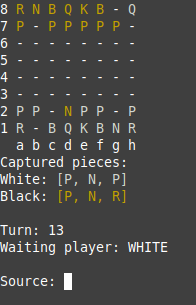

# Chess System Java
<p align="center">
    
</p>

> It is a chess game developed only with object orientation, uniting the main techniques, such as: delegation, encapsulation, inheritance and polymorphism, obtaining the result of all the movements of this game.

## 💻 OOP Topcs:
* Encapsulation
* Inheritance
* Polymorphism
* Overriding
* Exceptions
* Abstract method / class
* Delegation
* Upcasting
* Downcasting
* Associations
* Access Modifiers
* Static members
* Layers pattern

## 🎲 Data Structures Topics:
* Matrix
* List

## 🚀 Executing project
1. Clone the project: 
    ```<git clone git@github.com:AlissonWenceslau/chess-system-java.git >```
2. Open the project in the folder in the **git bash** terminal
3. Write: ``` cd bin/ ```
4. Next step, write: ``` java application/Program ```